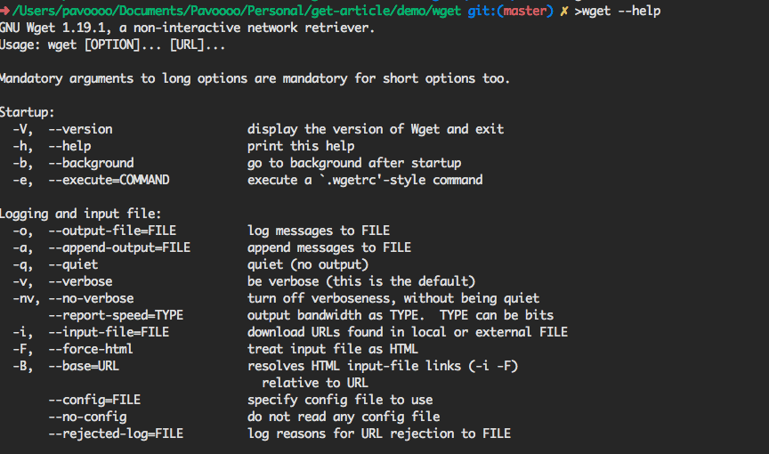
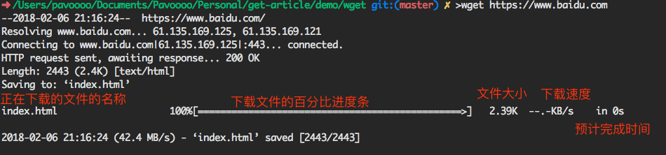
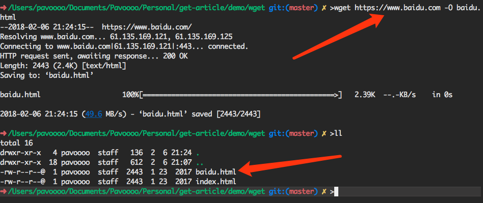
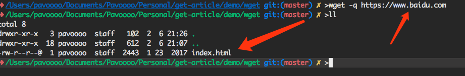
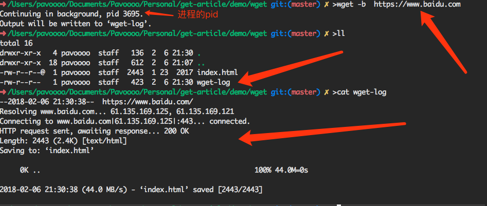
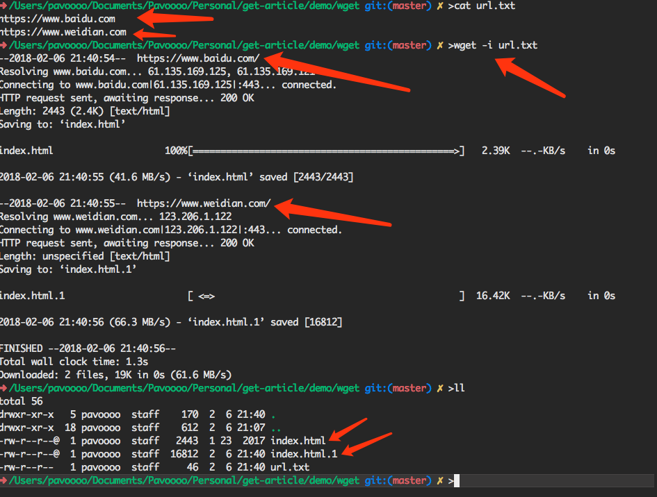
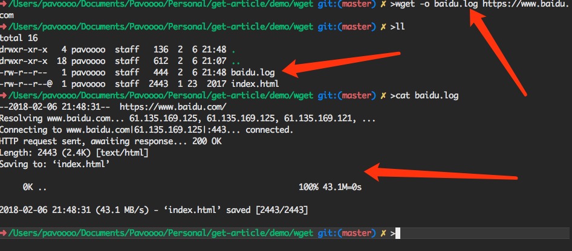
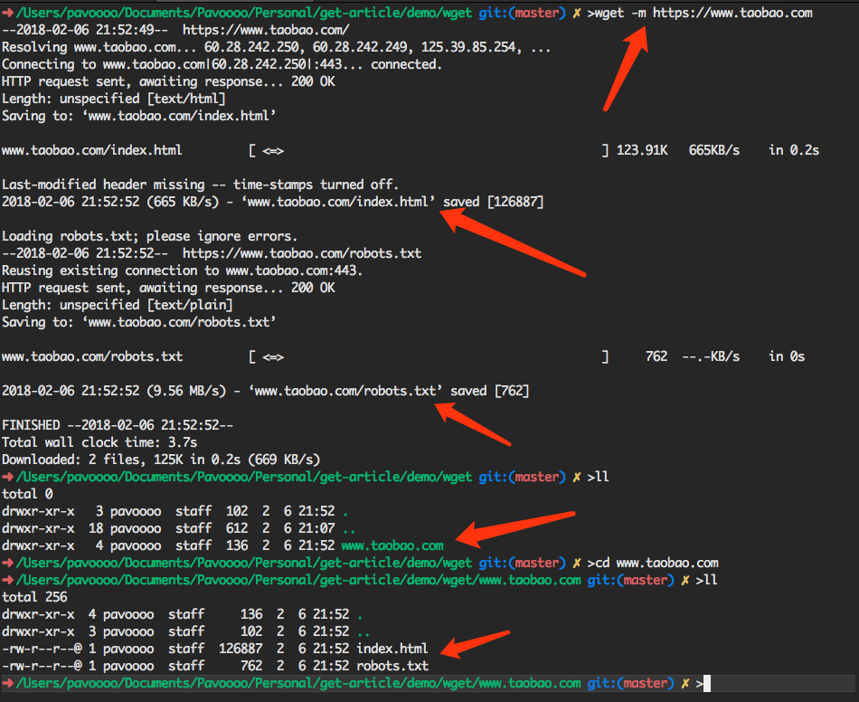
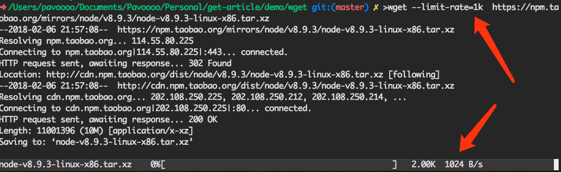

## linux wget命令
`wget`是一个十分有用的命令行工具，主要用于在linux平台上下载文件。这个程序可以使用常用的协议(比如：`http`, `https`, `ftp`等)从服务器上下载文件。它是一个在后台运行的命令，因此可以在`shell`脚本和`cron`定时作业中使用。下面就是一些常用`wget`命令。

### 查看帮助
为了更多的理解`wget`命令，我们可以使用如下命令查看`wget`所支持的一些选项。
```bash
wget --help
```
输出内容如下(输出的内容很多，没有全部截取)：


所以，`wget`的基本用法就是：
```bash
wget [OPTIONS] [URL]
```
### 下载文件
下载文件是`wget`最最基本的功能。如果只单单的从网上下载文件，使用如下命令即可。这个命令会把url指定的文件下载到当前目录。
```bash
wget <url>
```
比如：
```bash
wget https://www.baidu.com
```

从`wget`的输出信息中，我们能够看到如下几部分的内容：

- 正在下载的文件的名称
- 下载文件的百分比进度条
- 文件大小
- 当前的下载速度
- 预计下载完成时间

### 重命名下载文件
我们可以使用`-O`选项为我们下载的文件指定一个新的名称。即：
```bash
wget <url> -O 新名称
```
如我们下载百度首页，并重新命名为`baidu.html`。
```bash
wget https://www.baidu.com -O baidu.html
```


### 静态下载
静态下载就是指没有任何的下载提示，直接下载文件并保存。静态下载主要使用选项`-q`。
```bash
wget -q url
```
如:



### 恢复下载
恢复下载类似于断点下载的功能，主要依靠于`-c`选项。用法如下：
```bash
wget -c url
```

### 后台下载
后台下载有点类似于静态下载，不会实时输出下载的信息。和静态下载不同的是，会在当前终端输出进程的pid以及输出的信息保存的文件的名称。
```bash
wget -b url
```
比如：


### 多次下载
多次下载指的就是我们可以同时下载多个文件。我们只需要使用`-i`选项，后面跟一个包含多个`url`(每个URL是一行)的文件就可以使用，它会同时为我们下载`url`所指定的内容。
```bash
wget -i 文件名称 <url>
```
比如我们同时下载`百度`和`微店`的首页。



### 下载不受信任的文件
我们可以使用`--no-check-certificate`选项来跳过`ssl/tls`证书的验证。
```bash
wget --no-check-certificate url
```

### 日志重定向
我们可以使用`-o`选项将`wget`的输出重定向到一个文件中去。
```bash
wget -o 文件名称 url
```


### 下载完整网站
我们可以使用`-m`选项下载完整的网站的内容，而不是仅仅下载网站首页的文件。
```bash
wget -m url
```
比如：



### 限速
限速是一个特别重要的功能，尤其我们在服务器上下载文件的时候。我们可以使用`--limit-rate=速度`限制下载速度。其中速度可以是千字节(带`k`后缀)或者兆子节(带`m`后缀)。
```bash
wget --limit-rate=10k url
```
比如
```bash
wget --limit-rate=1k  https://npm.taobao.org/mirrors/node/v8.9.3/node-v8.9.3-linux-x86.tar.xz
```


上面就是一些`wget`比较常用的功能，以后会慢慢添加。