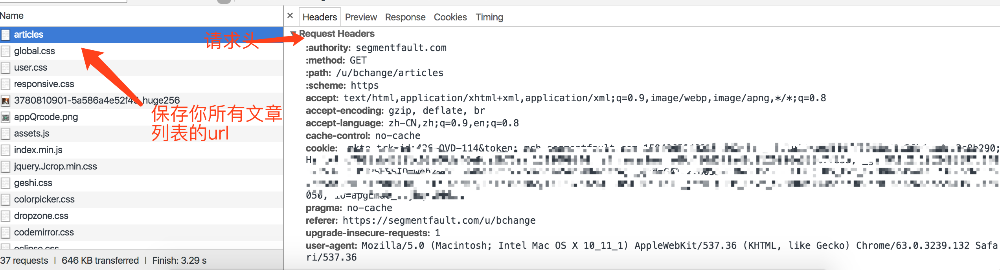
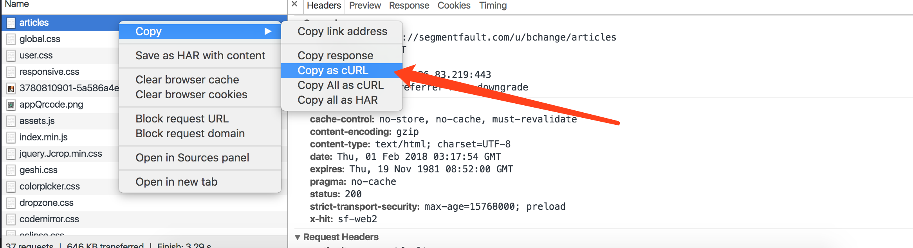
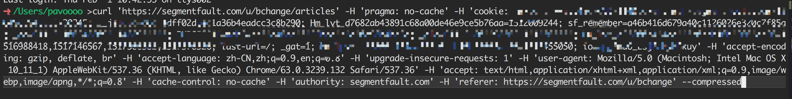
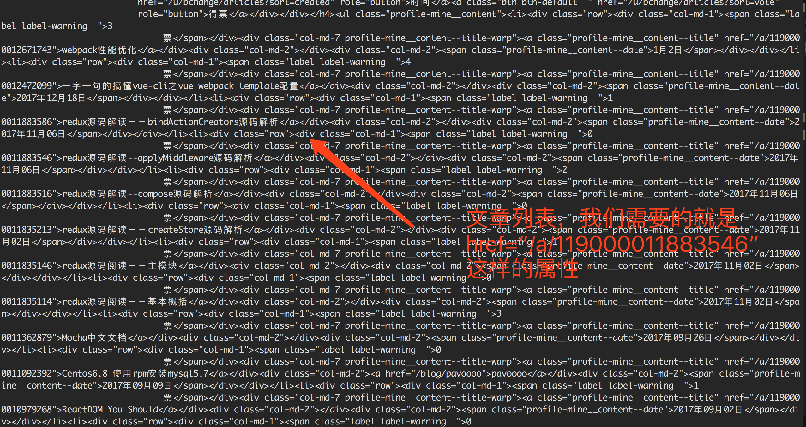
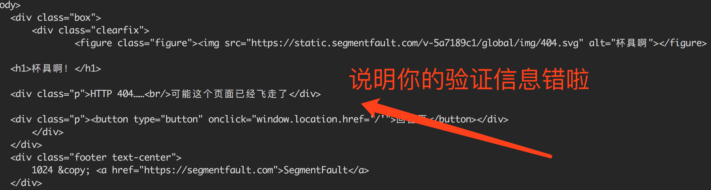

## 从Segmentfault搬家

厌倦了万紫千红一片绿，我就偷偷的把自己的文章扒了下来。回归`github`。

从`Segmentfault`搬家还是挺简单的，就下面几个流程：

> 首先你要登录 -> 然后进入你的主页查看`我的文章`(获取文章列表) -> 打开控制台，随便点击一篇文章，进入编辑的页面 -> 控制台中找出保存文章原始内容(md)的接口 -> 爬 -> 保存到本地

在上面的几个流程中，需要注意的一点就是，`Segmentfault`对接口做了一些基本的验证，所以，我们在进行http请求的时候，需要带上必要的请求头。但是哪些请求头是必要的呢，下面就介绍一个简单的方法。

> 打开控制台, 在控制台中找出保存文章列表的URL，以及所有的请求头信息。



> 在链接上，右键，点击`copy as cURL`



> 打开终端，`Ctrl + v`粘贴



> 回车，请求，不出意外，你的终端会出现如下的`html`，找出文章列表部分



> 稍有不慎，你也可能出现下面这种情况



到这里，我们就可以通过`curl`进行`request headers`的分析了，去除那些可有可无的字段(不会进行验证的字段)。对于保存文章原始内容接口的分析，我们也可以按照这种方法处理。明白了整个流程，代码是十分简单的。这里主要使用`nodejs`处理，你可以选择任何语言，毕竟只是工具。

**下面代码中的header信息，都要换成自己的，不然肯定会game over的**

```js
const axios = require('axios')
const fs = require('fs')

const articleList = 'https://segmentfault.com/u/bchange/articles'
const userAgent = 'Mozilla/5.0 (Macintosh; Intel Mac OS X 10_11_1) AppleWebKit/537.36 (KHTML, like Gecko) Chrome/63.0.3239.132 Safari/537.36'

const articleListHeader = {
    "cookie": '你的cookie信息',
    "referer": 'https://segmentfault.com/u/bchange'
}
const articleDetailHeader = {
    "cookie": "你的cookie信息",
    "referer": "https://segmentfault.com/a/1190000007375259/edit",
    "accept": "application/json, text/javascript, */*; q=0.01"
}
// 匹配链接
const articleLinkRex = /\/a\/(\d+)/g

axios.get(articleList, Object.assign(articleListHeader, {
    'user-agent': userAgent
}))
.then(response => {
    const html = response.data || ""
    return html.match(articleLinkRex) || []
})
.then(async links => {
    for(let link of links) {
        // get article id
        link = link.slice(link.lastIndexOf('/') + 1)
        const url = `https://segmentfault.com/api/article/${link}/revisions?_=6d0231bff9af7d2111d3858f99c8ec49`
        
        const {data: article} = await axios.get(url, {
            headers: Object.assign(articleDetailHeader, {
                'user-agent': userAgent
            })
        })
        writeArticleToFile(article.data[0]['title'], article.data[0]['text'])
    }
    
})

// 写入到本地的文件中
function writeArticleToFile(title, text) {
    const content = `## ${title}\n${text}`
    fs.writeFile(`./articles/${title}.md`, content, 'utf8', (err) => {
        if(err) {
            console.error(`${title}写入失败`)
        }else {
            console.log(`${title}写入成功`)
        }
    })
}
```
文章爬下来了，还有一些需要处理的地方，就是文章中引用的图片的链接的问题。搞好之后，再来说，嘿嘿！！！